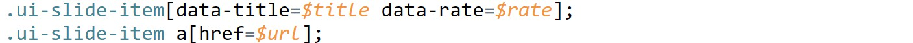
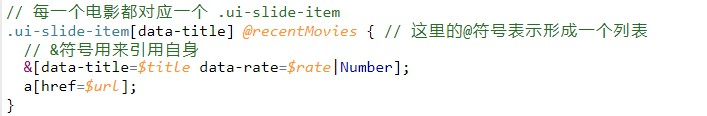

# temme：优雅地从 HTML 提取 JSON 数据

本文介绍了一个从 HTML 提取 JSON 数据的工具，并以豆瓣电影的例子展示了该工具的使用方法。本文中用到了大量的 CSS 选择器，CSS 选择器可以参考 [MDN](https://developer.mozilla.org/zh-CN/docs/Learn/CSS/Introduction_to_CSS/Selectors)。

最近几个月写 Node 爬虫比较多，解析 HTML 文档用的工具是 [cheerio](https://github.com/cheeriojs/cheerio)（cheerio 可以认为是服务器版的 jQuery）。cheerio 功能相当丰富，提供了一大堆 API 来查询/修改/删除/添加结点或文本。不过随着爬取的页面数量越来越多，大量使用 cheerio 还是显得繁琐了一点。爬虫对于处理 HTML 的模式其实比较固定，但是 cheerio 处理某些模式时不够简洁明了，下面三点就是一些比较常见的情况：


下面的三点中，假设我们要从豆瓣电影首页中爬取上图这样一个 [「正在热映」](https://movie.douban.com/%23screening)列表。注意该列表是实时更新的，所以本文中下面的选择器的运行结果可能不同。
   1. 同一个元素会包含多个数据字段。比如上图中每个电影都有电影标题 `title`，链接 `url`和评分 `rate` 字段；
   2. 爬取目标是一个列表（甚至是列表的列表）。比如上图中我们需要抓取一个电影信息列表；
   3. 频繁但简单的格式处理。例如：将电影的评分从字符串类型转化为数字，去除电影链接中不需要的 url 参数。

[temme](https://github.com/shinima/temme) 就是基于以上几点观察而开发出来的处理 HTML 的工具。temme 在 CSS 选择器的基础上，针对以上三点，加入了额外的语法来优雅地处理上述情况：

1. 支持同时使用多个选择器；支持多个字段同时抓取；
2. 支持列表抓取；
3. 支持格式处理。

## 安装与使用

```bash
# 全局安装
yarn global add temme # npm install --save temme

# 最基本的使用方式
temme <selector> <html>

# 省略html参数，使用来自stdin的输入；--format 参数表示格式化输出
temme <selector> --format

# 使用文件中的选择器
temme <path-to-a-selector-file> <html>

# 和 curl 配合使用
curl -s <url> | temme <selector>
```

temme 提供了一个 [在线网页版本](https://temme.js.org/)，其中的编辑器提供了语法高亮功能。本文的剩下的部分也可以在该在线版本中进行，注意将对应的 HTML 复制过来即可。

## 例子一：从豆瓣电影首页抓取电影信息

抓取第一个电影的标题，评分以及链接。temme 选择器如下：



命令行运行步骤如下:
```bash
curl -s https://movie.douban.com | temme '.ui-slide-item[data-title=$title data-rate=$rate]; .ui-slide-item a[href=$url];' --format
# output:
# {
#   "title": "烟花 打ち上げ花火、下から見るか？横から見るか？",
#   "rate": "5.7",
#   "url": "https://movie.douban.com/subject/26930504/?from=showing"
# }
```

例子中的选择器和 CSS 选择器非常相似，不一样的地方在于 temme 选择器包含了下面这样的结构：`[foo=$bar]`。该结构的含义是「将 foo 属性放到结果的 bar 字段」。上面的选择器包含了三个这样的结构，一次性选取了三个字段。上面的选择器也同时包含了两个子选择器（在图中每行一个），每个子选择器用分号作为结束符。

另一个常见的结构是 `div{$buzz}`，该结构表示「将 div 元素的文本内容放到结果的 buzz 字段」。如果熟悉 [emmet](https://emmet.io/) 的话，可以看出来目前 temme 的行为就是 emmet 的逆过程。

## 例子二：格式变换

上面结果中 `rate` 是个字符串，我们可以用过滤器 `Number` 对其进行处理。我们这次不选取其他字段。

```bash
curl -s https://movie.douban.com | temme '.ui-slide-item[data-rate=$rate|Number];'
# output: {"rate":5.7}
```

可以看到结果中 `rate` 字段类型为数字。目前结果中只有 `rate` 一个字段，那么将该字段的值直接作为结果更为方便： 

```bash
curl -s https://movie.douban.com | temme '.ui-slide-item[data-rate=$|Number];'
# output: 5.7
```

省略 `$xxx` 中的 `xxx`，那么结果的格式会从 `{ xxx: yyy }` 变为 `yyy`。

## 例子三：「正在热映」列表

「正在热映」是一个列表，每一个电影信息对应一个满足 CSS 选择器 `.ui-slide-item[data-title]` 的 HTML 元素。上面的例子我们只选取了第一个电影的数据，这里我们使用 `@` 符号来选取该列表。抓取「正在热映」列表中所有电影的信息，选择器如下：



运行效果如下：

```bash
curl -s https://movie.douban.com | temme '.ui-slide-item[data-title] @recentMovies { &[data-title=$title data-rate=$rate|Number]; a[href=$url]; }' --format
# output:
# {
#   "recentMovies": [
#     {
#       "title": "烟花 打ち上げ花火、下から見るか？横から見るか？",
#       "rate": 5.7,
#       "url": "https://movie.douban.com/subject/26930504/?f  rom=showing"
#     },
#     {
#       "title": "相声大电影之我要幸福",
#       "rate": 0,
#       "url": "https://movie.douban.com/subject/26811605/?f  rom=showing"
#     },
#     ......
#   ]
# ]
```

**选择器含义**：每一个满足 CSS 选择器 `.ui-slide-item[data-title]` 的 HTML 元素就是一个电影详情的父元素，我们将 `@` 放在该选择器之后，紧跟的 `recentMovies` 表示「最近热映列表」在最终结果中的字段名，然后我们在花括号中放入例子一中的两个选择器，以选取单个电影的数据。

如果我们在这里省略 `@recentMovies` 中的 `recentMoviews`，仅保留一个 `@` 符号，那么最终结果就会变为一个数组（JSON 的层级会减一层）。

列表的捕获可以进行嵌套。例如在一个 stackoverflow 问题页面中有多个回答，每个回答下有多个评论，下面的选择器可以将这些评论以二维列表的格式抓取下来：

```bash
curl -s https://stackoverflow.com/questions/1014861/is-there-a-css-parent-selector | temme '.answer@{ .comment@{ .comment-body{$|trim}; }; };'
```

## 例子四：电影详情页面


在首页爬取到电影链接列表之后，我们可以进入每个电影的页面爬取该电影的详细数据。这里我们以 [烟花](https://movie.douban.com/subject/26930504/) 这个电影为例子。电影介绍页面中的数据非常详细，包含了电影名称、导演、编剧、主演、电影类型、官方网站等信息。这里挑取了部分数据进行抓取，选择器如下：

```
// 电影的名称
[property="v:itemreviewed"]{$title};
// 电影上映年份
.year{$year|substring(1, 5)|Number};
// 电影导演
[rel="v:directedBy"]@directedBy { &{$} };
// 电影编剧 （:contains是来自jQuery的选择器 https://api.jquery.com/contains-selector/）
:contains('编剧') + span{$storyFrom|split('/')||trim};
// 电影主演（前三位）
[rel="v:starring"]@starring|slice(0, 3){ &{$} };

// 平均评分
[property="v:average"]{$avgRating|Number};
// 具体的评分情况
.ratings-on-weight .item@ratingInfo{
  span[title=$title];
  .rating_per{$percentage};
};

// 电影剧情简介
[property="v:summary"]{$summary|trim};

// 喜欢这部电影的人也喜欢...
.recommendations-bd dl@recommendations{
  img[alt=$name src=$imgUrl];
  a[href=$url];
};
```

这里选择器较长，写在终端中不太方便，我们将该选择器保存到文件 *douban-movie.temme*，然后运行 temme：

```bash
curl -s https://movie.douban.com/subject/26930504/ | temme douban-movie.temme --format
# output:
# {
#   "title": "烟花 打ち上げ花火、下から見るか？横から見るか？",
#   "year": 2017,
#   "directedBy": [ "新房昭之", "武内宣之" ],
#   "storyFrom": [ "岩井俊二", "大根仁" ],
#   "starring": [ "广濑铃", "菅田将晖", "宫野真守" ],
#   "avgRating": 5.4,
#   "ratingInfo": [
#     { "title": "力荐", "percentage": "7.2%" },
#     { "title": "推荐", "percentage": "12.8%" },
#     ......
#   ],
#   "summary": "川村元气即将再度与《你的名字。》制......",
#   "recommendations": [
#     {
#       "name": "想要传达你的声音",
#       "imgUrl": "https://img3.doubanio.com/vie......",
#       "url": "https://movie.douban.com/subject......"
#     }
#     ......
#   ]
# }
```

该选择器虽然选取了很多内容，但是仍然保持了清晰的结构以及良好的可读性。可以打开[该例子的在线版本](https://temme.js.org/?example=douban-movie-summary-Chinese)，对比其中选择器和输出的格式，应该可以明白该选择器的含义。

写爬虫的时候，我们首先分析页面结构，利用在线版本为每一种不同类型的页面写好对应的选择器，然后将选择器保存在本地文件中。爬虫运行获取到 HTML 之后，我们读取相应的选择器文件，运行并得到想要的输出。

## 总结与其他

上面的介绍基本涉及到了 temme 的核心用法，可以看到 temme 实现了前面提到的改进思路。实践中大部分网站的页面结构都是比较清晰的，分析页面元素的 CSS 选择器也比较容易，此时使用 temme 可以大大提高数据选取的效率。temme 更完整的用法和文档还请移步 [Github](https://github.com/shinima/temme)，欢迎 fork 和 star。

下面列举一些开发用到的主要技术：

- 开发语言 [TypeScript](https://www.typescriptlang.org/)
- 自定义语法解析 [PEG.js](https://pegjs.org/)
- HTML解析 [cheerio](https://github.com/cheeriojs/cheerio)
- 编译工具 [webpack](https://webpack.js.org/)
- 自动化测试 [Jest](https://facebook.github.io/jest/)
- 在线版本编辑器 [ace](https://ace.c9.io/)
- 灵感来自 [emmet](https://emmet.io/)
