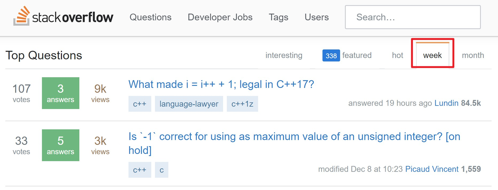
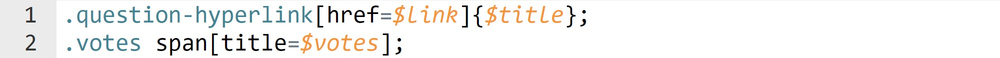
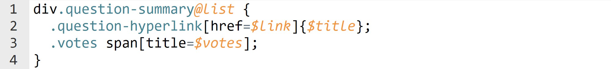
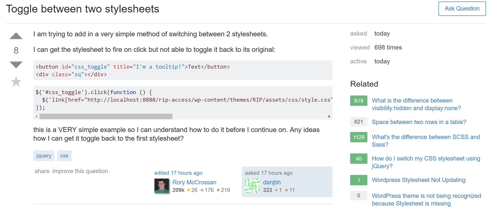
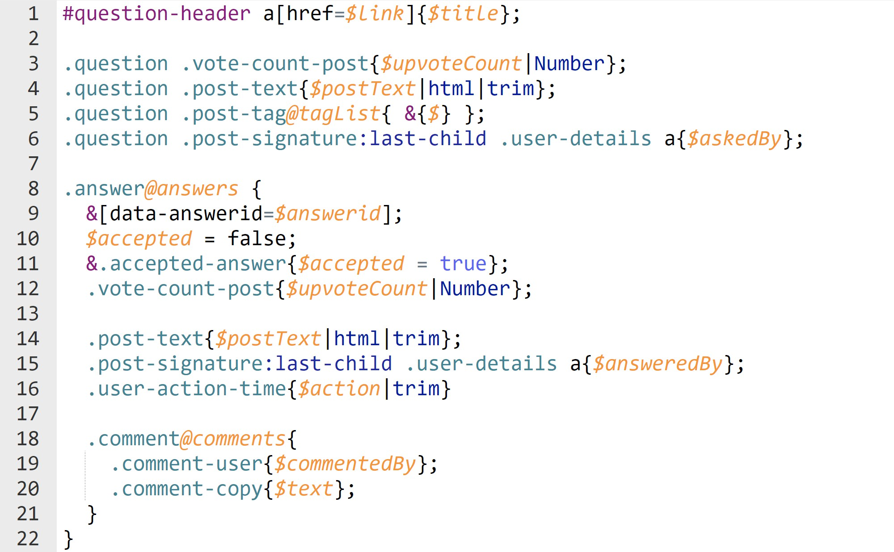

# [WIP] Temme: A Concise and Convenient Way to Extract JSON from HTML

This article introduces a tool that extracts JSON from HTML. We will use the HTML from StackOverflow to illustrate how to use temme. Temme is based on [cheerio](https://github.com/cheeriojs/cheerio) and uses CSS selectors extensively, so [MDN](https://developer.mozilla.org/en-US/docs/Learn/CSS/Introduction_to_CSS/Selectors) may be helpful.

The term *node* in this article refers to an `HTMLElement` in DOM or a `CheerioNode` in cheerio. And the term *item* in this articel refers to data entries in elements/nodes which can be extracted. For example, items can be `href` attributes in anchor elements, or `class` attributes in any HTML element, or text content of any HTML element.

Recent days, I spend a lot of time on coding web crawlers. I use [cheerio](https://github.com/cheeriojs/cheerio) (server-side jQuery) to parse HTML. Cheerio implements various functions from core jQuery and provides a lot of APIs that manipulate the HTML document. However, as more and more HTML documents are crawled, the code using cheerio becomes complex and intractable. Web crawlers have some common patterns to extract data from HTML which do not fit well with cheerio. Here are some typical cases:



The following cases assume that we are crawling a list of top questions from StackOverflow as the above figure shows.

1. Different items need to be extracted on the same node. For example, every question has a title, a link, a list of tags, and counts for votes/answers/views. All these items are stored in nodes that matches `div.question-summary`.
2. The target of crawling is an array of items (even an array of array of items). A list of top questions is just a good example.
3. Simple but frequent formatting, like converting the type of views count from string to number, or converting the link from relative to absolute.

Temme is a tool that I have developed to extract JSON from HTML. Temme adds some extra grammar on CSS selector. The methods that temme adopts to deal with the above cases are:

1. Supports for multiple selectors; Supports for extracting multiple items;
2. Supports for extracting a list of items;
3. Supports for formatting.

## Installation

```bash
# Command line tool prefers global installation
yarn global add temme

# Basic usage
temme <selector> <html>

# Use html from stdin; --format to format the output
temme <selector> --format

# Use selector from a file
temme <path-to-a-selector-file>

# Pipe html from `curl` to `temme`
curl -s <url> | temme <selector>
```

Temme offers an [playground](https://temme.js.org) in which the editor supports syntax highlighting. The remaining parts of this article can also be run on the playground. Note that the HTML needs to be copies manually.

## Example-1: Extract Items of the First Question

The selector to extract items of the first question is as follows:



```bash
curl -s https://stackoverflow.com/?tab=week | temme '.question-hyperlink[href=$link]{$title}; .votes span[title=$votes];' --format
# output
# {
#   "link": "/questions/47702220/what-made-i-i-1-legal-in-c17",
#   "title": "What made i = i++ + 1; legal in C++17?",
#   "votes": "107 votes"
# }
```

The temme-selector above is very like CSS selector. The difference is that temme-selector contains syntax constructs like `[foo=$bar]` and `${buzz}`. Syntax construct `[foo=$bar]` is called **attribute-capture** and it means that *put the value of attribute foo into the field bar in result*; Syntax construct `${buzz}` is called **content-capture** and it means that *put the text content of the node into field buzz in result*.

The above temme-selector contains two attribute-captures and one content-capture. It extracts three different items all at once. The above temme-selector also contains two sub-selectors, each ends with a semicolon.

If you are familiar with [emmet](https://emmet.io/), you can figure out that the behavior of temme is like the reverse of emmet. [More details here.](https://github.com/shinima/temme#inspiration)

## Example-2: Simple Formatting

In example-1, we have captured three items of the first question. Item `votes` is `'107 votes'` of type string. If we call `votes.replace(" votes", "")` then we can get `'107'`. In temme, we can use **filters** to format the output (We do not capture other items this time):

```bash
curl -s https://stackoverflow.com/?tab=week | temme '.votes span[title=$votes|replace(" votes", "")];'
# output: {"votes":107}
```

Filters can be simply chained so we now use filter `Number` to convert `'107'` to a number.

```bash
curl -s https://stackoverflow.com/?tab=week | temme '.votes span[title=$votes|replace(" votes", "")|Number];'
# output: {"votes":107}
```

In this example, all we capture is a single item `votes`. We can omit `votes` in `$votes` and make a **default-capture**:

```bash
curl -s https://stackoverflow.com/?tab=week | temme '.votes span[title=$|replace(" votes", "")|Number];'
# output: 107
```

The meaning of default-capture is simple: If we omit `xxx` in `$xxx`, then the structure of result will change from `{ xxx: yyy }` to `yyy`.

## Example-3: The List of Top Questions

Every top question corresponds to a node matching CSS selector `div.question-summary`. Example-1 only extracts items of the first question. Here we use `@` to make an array-capture that extracts the entire list of questions. The selector is as follows:



```bash
curl -s https://stackoverflow.com/?tab=week | temme 'div.question-summary@topQuestions { .question-hyperlink[href=$link]{$title}; .votes span[title=$votes]; }' --format
# output
# {
#   "topQuestions": [
#     {
#       "link": "/questions/47702220/what-made-i-i-1-legal-in-c17",
#       "title": "What made i = i++ + 1; legal in C++17?",
#       "votes": "107 votes"
#     },
#     {
#       "link": "/questions/47698476/is-1-correct-for-using-as-maximum-value-of-an-unsigned-integer",
#       "title": "Is `-1` correct for using as maximum value of an unsigned integer? [on hold]",
#       "votes": "33 votes"
#     },
#     ......
#   ]
# }
```

The meaning of the selector: every question corresponds to a node matching `div.question-summary` and we place `@` after the selector, which means we are going to capture an array of items. The following `topQuestions` is the field name that the question list will be in the final result. Then we copy the selectors in example-1 and paste it into the curly brace to capture the items of individual question. The selector extracts the list of top questions in a concise way.

Here we can omit `topQuestions` in `@topQuestions` and make a default-capture as in example-1, then the result will just be the list of top questions.

The array-capture can be nested, and nested array-capture can extract an array of array of items. For example, in the question page on StackOverflow, a question has several answers, and each answer has several comments. We can use the following selector to extract an array of array of comments:

```bash
curl -s https://stackoverflow.com/questions/1014861/is-there-a-css-parent-selector | temme '.answer@{ .comment@{ .comment-body{$|trim}; }; };'
```

## Example-4 The Detail of Question



After getting a list of top questions, we can follow the link of each question to get the detail of the question. Here, we select [this question](https://stackoverflow.com/questions/47772015/toggle-between-two-stylesheets) as our exmaple in the above image. We use the following temme-selector to extract various items about the question:



The temme-selector is so long that we need to save it to a file namely *question-detail.temme*. We then use the filename to refer to the selector. [This example is also available on the playground](https://temme.js.org?example=so-question-detail).

```bash
curl -s https://stackoverflow.com/questions/47772015/toggle-between-two-stylesheets | temme question-detail.temme --format
# output:
# {
#   "link": "/questions/47772015/toggle-between-two-stylesheets",
#   "title": "Toggle between two stylesheets",
#   "upvoteCount": 8,
#   "postText": "<p>I am trying to add in a very simple method of......",
#   "tagList": [ "jquery", "css" ],
#   "askedBy": "danjbh",
#   "answers": [
#     {
#       "answerid": "47773428",
#       "accepted": true,
#       "upvoteCount": 4,
#       "postText": "<p>This is an alternative solution to consider......",
#       "answeredBy": "UncaughtTypeError",
#       "action": "answered 17 hours ago",
#       "comments": [
#         { "commentedBy": "danjbh", "text": "Thank you for the in-depth......" },
#         { "commentedBy": "UncaughtTypeError", "text": "@danjbh Thank you for the......" }
#         // ...... more comments
#       ]
#     }
#     // ...... more answers
#   ]
# }
```

This selector uses value-capture/array-catpure extensitively and extracts lots of items while remains clear and readable. The output has a similar structure as the temme-selector, which makes understanding the selector more easily.

There are some other syntax constructs and their meanings are as follows: The `&` (line 9, 11) means referrence to the parent node (like in less, sass or [stylus](http://stylus-lang.com/docs/selectors.html#parent-reference)); In line 10, temme first sets `$accept` to `false`, then if temme finds that the parent node matches `.accepted-answer` (line 11), temme sets `$accept` to `true`.

When implementing a web crawler, we first analyze the structure of the web page, then write down the temme-selector on the playground for every kind of page, and then save the selector to a file. When the crawler have downloaded the HTML document, we use the corresponding selector to extract JSON from HTML.

## Conclusion

The examples have covered most of the temme. In practice, most websites have a clear HTML structure which is easy to analyze, and temme fits well in such situations. In my experience coding the crawlers, temme turns out to be a concise and convenient tool to extract structured JSON from HTML. You can goto [the GitHub repository](https://github.com/shinima/temme) for the full documentation.
