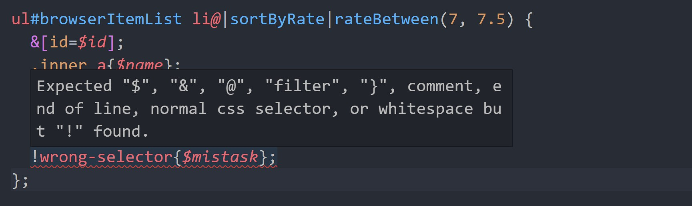

# vscode-temme

VSCode extension for [temme selector](https://github.com/shinima/temme).

## Features & Usages

#### 1. Syntax highlighting for temme files

#### 2. Runnig temme selectors directly from vscode

Method: Command palette -> Temme: Run temme selector

Before running temme selectors directly from vscode, you need to have some tagged-links in temme file.

#### 3. Watch mode

Method: Command palette -> Temme: Start watching

In watch mode, every time the selector changes, the result will be re-calculated automatically. Only one watching task can be active at a time. Before you start another task, the active watching task will be cancelled automatically.

#### 4. Tagged-links

This extension will recognize pattern `// <tag> path` in temme files. When the cursor is at lines which contain tagged-link, vscode will provide some the following code actions. Tagged-link is required if you want to run temme selectors in vscode.

#### 5. Status Bar Items

This extension will display some useful items in status bar.

#### 6. Error reporting for syntax errors

Note: Syntax errors are displayed at the correct line. Runtime errors in watching mode are always displayed at the first line.

## Known Issues

If you have any suggestions/questions, just fire an issue [here](https://github.com/shinima/vscode-temme/issues). O(∩_∩)O

## Release Notes

### 0.7.0

Initial release.
